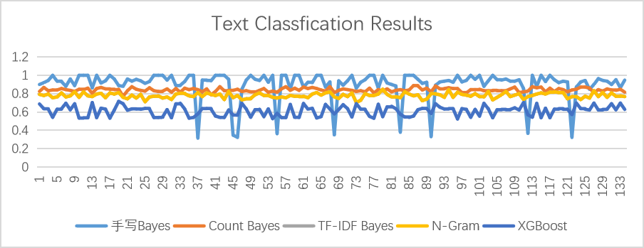

# Hi, this is Youcheng Li's code repository :)

Here are some of my projects, including text classification, pedestrian recognition based on SVM and audio image generation.

## Text Classification
I have implemented a news text classification algorithm.The raw data came from a Chinese news website, obtained by crawlers.First, I preprocess the text, removing HTML tags.After that, I use TF-IDF feature and word bag feature to achieve text representation.Finally, I used XGBoost and Naive Bayes classifier for classification.The text classification results are shown above in this image.

## Pedestrian recognition based on SVM
I used to implement pedestrian detection based on HOG feature.I use support vector machines to implement this classification algorithm.First, I extract the HOG feature of the image.After that, I used MATLAB to optimize the SVM model.Finally, I drew the ROC curve of the classification model to evaluate the classification results.

## Audio-Image Generation
For our big assignment in natural Language processing, I chose the topic audio image generation.This project allows you to speak a sentence in Chinese and output the scene corresponding to the sentence.In this project, I was responsible for determining the technical route, implementing the machine translation module and image generation module.Below is the framework of the project.

This image shows the concrete realization of each module of the project.A variety of programming languages, cutting-edge frameworks, which reflects my programming ability and teamwork ability.The image on the right shows the output.

## Self-introduction

My university, Xi 'an Jiaotong University, is located in Xi 'an, a city full of history and culture.Xi 'an Jiaotong University is one of the top 10 engineering universities in China.

I majored in artificial intelligence.Artificial intelligence scholars at Xi 'an Jiaotong University have greatly promoted the development of artificial intelligence, with outstanding achievements in the field of computer vision, such as ResNet and ShuffleNet.These scholars are my lecturers.My major attaches great importance to students' ability to think independently and solve problems.When I was a freshman, I entered the laboratory to carry out scientific research, and I have been paying attention to the introduction of the medical industry.

At the same time, MY academic performance is excellent.My GPA is 3.71, ranking third in my major, and I once won a national scholarship.I think it reflects my diligence and interest in artificial intelligence.Combined with my professional knowledge, I have carried out a number of research topics covering financial markets, brain science and image processing.I will focus later on my experience in machine learning, computer vision and medical image processing.
